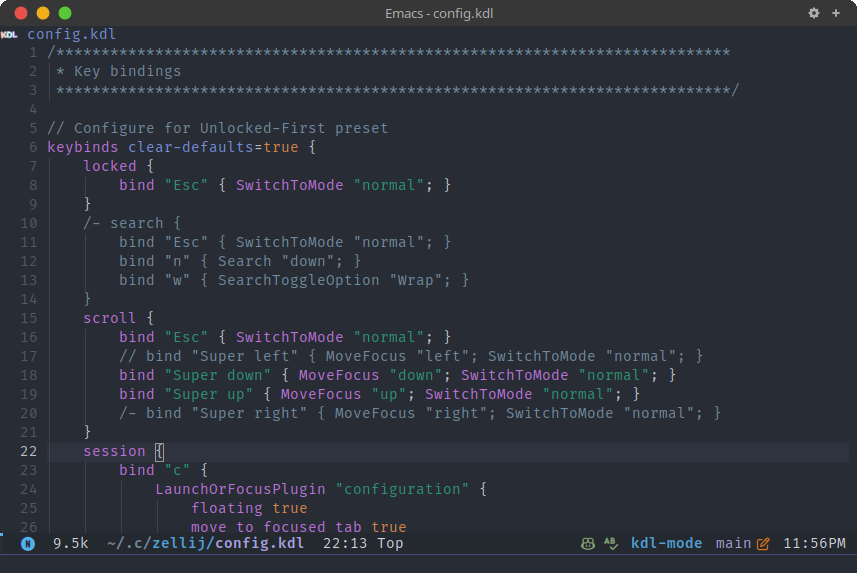

# kdl-mode

Emacs major mode for editing files in the [KDL document language](https://kdl.dev/).

---

# Installation

- Automatic package installation from [Melpa](https://melpa.org/).

# Features

- Syntax highlighting using regular expression

- Syntax highlighting using Tree-Sitter (support Slashdash `/-` comment style )

- Automatic code indentation.

# Screenshot

# Troubleshooting

- If `tree-sitter-kdl` isn't installed automatically when open a KDL file, you may need to run `M-x kdl-install-tree-sitter-grammar` to manually install `tree-sitter-kdl`.

# Acknowledgement

- Syntax highlighting using [tree-sitter-kdl](https://github.com/tree-sitter-grammars/tree-sitter-kdl) was adopted from [kdl-ts-mode](https://github.com/dataphract/kdl-ts-mode/):
